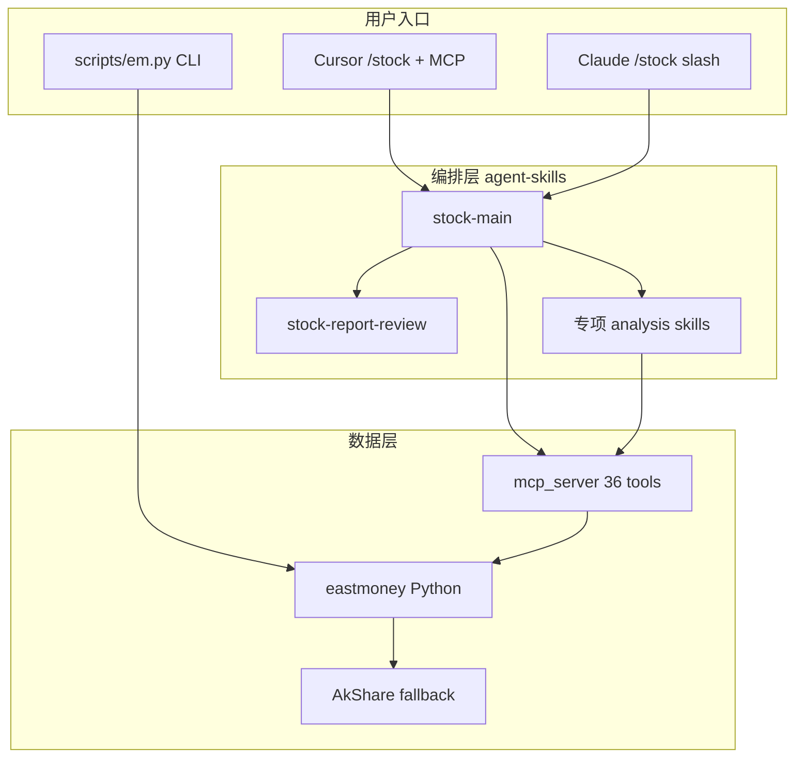

# Agent 协作指南

面向在本仓库上工作的 AI Agent 与贡献者：数据层、Skills 编排、命令路由一览。

> 数据仅供参考，不构成投资建议。

---

## 架构



---

## 目录

| 路径 | 作用 |
|------|------|
| `eastmoney/` | 东方财富 + 雪球 + 量化数据实现 |
| `mcp_server/` | Cursor MCP `eastmoney-stock` |
| `scripts/em.py` | 无 AI 时的 CLI |
| `agent-skills/` | 13 个分析 workflow（含 `stock-main`） |
| `agent-commands/` | Cursor 快捷指令 `*.md` |
| `agent-slash-skills/` | Claude/Codex `$stock-*` |
| `models/` | 演示 LGB 权重 + OOS metrics |

---

## 命令路由（Agent 必遵）

### 主流程（要报告 / 要立场）

| 意图 | 命令 | 模板 | 审核 |
|------|------|------|------|
| 个股全量 | `/stock 分析 {标的}` | analysis-report.md | B：`get_review_protocol(flow=B)`，工具 ≥20，**§7 审核纪要** |
| 板块+选股 | `/stock {板块}…推荐` | sector-report.md | C：flow=C，工具 ≥12 |
| 市场热点 | `/stock-market` 或 `/stock 今天热点` | market-brief.md | D：flow=D |

### 单维度（不要 review-protocol）

| 命令 | Skill | 仅当 |
|------|-------|------|
| `/stock-fund` | stock-capital-flow | 只问资金 |
| `/stock-chip` | stock-chip-analysis | 只问筹码 |
| `/stock-kline` | stock-technical-analysis | 只问技术面 |
| `/stock-basic` | stock-fundamental-analysis | 只问基本面 |
| `/stock-news` | stock-event-research | 只问舆情/公告 |
| `/stock-sector` | stock-sector-analysis | 只看板块，不选股 |

**转交规则**：用户问「能不能买 / 看几日线 / 介入区间 / 全量」→ 必须 **`/stock 分析`**，不得在单维 Skill 里凑完整投资建议。

### 查价

| 输入 | 行为 |
|------|------|
| 仅代码/名称，无分析词 | stock-quick-lookup |

---

## 数据工具约定

- 共 **36** 个 MCP/CLI 工具；列表：`python scripts/em.py list`
- 任意分析前先 `resolve_symbol`
- secid：沪 `1.{code}`，深/北 `0.{code}`
- 雪球：`xueqiu_hot` 免登录；`xueqiu_livenews`/帖子需浏览器 Cookie；`interrupt` → 引导登录 hq 页
- `get_quant_technical` 含 `oos_status`；**quant 非 guaranteed 策略信号**
- 东财失败 → AkShare 降级（K 线训练/回测用 `get_kline_resilient`）

---

## 开发

```bash
bash scripts/install.sh --target cursor --scope user   # venv + skills + mcp.json
bash scripts/check.sh                                  # 单元测试 + MCP parity
LIVE=1 bash scripts/smoke_live.sh                      # 真实接口冒烟
bash scripts/ensure_demo_models.sh                     # 演示 LGB 权重
bash scripts/lock_deps.sh                              # 更新 requirements.lock
```

- CI：`/.github/workflows/test.yml`（PR/push）
- 可选：`live-smoke.yml`（定时接口监测）
- Release：打 `v*` tag → 附 `models/alpha158_lgb.*`

---

## 禁止

- 投资顾问角色（buffett/graham 等）
- 跳过 review-protocol 直接交个股终稿
- 无工具来源的数字
- 必涨必买 / 全仓 / 稳赚

详细模板见 `agent-skills/stock-main/review-protocol.md`。

贡献与 PR：见 [CONTRIBUTING.md](CONTRIBUTING.md)。
