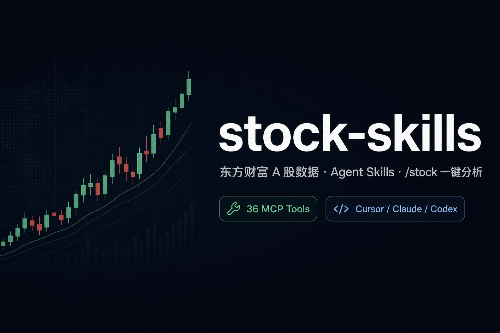
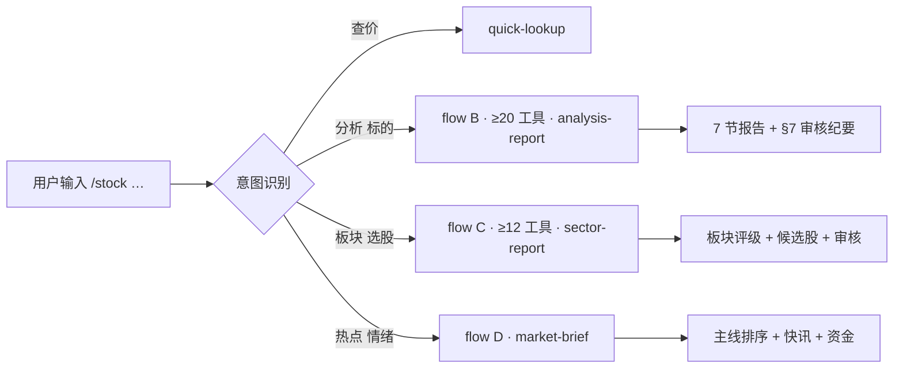
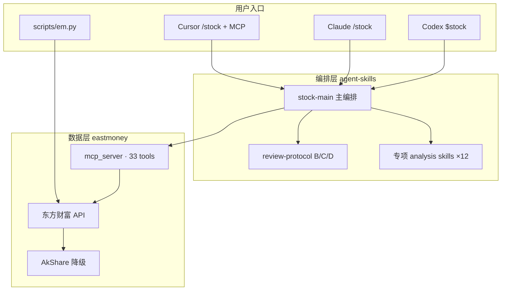

<div align="center">

# stock-skills

**东方财富 A 股数据 × Agent Skills × `/stock` 一键分析**

[](https://github.com/tetap/stock-skills/actions/workflows/test.yml)
[](https://tetap.github.io/stock-skills/)
[](https://github.com/tetap/stock-skills/releases)
[](LICENSE)
[](requirements.txt)

[快速开始](#-快速开始) · [安装](#-安装) · [用法](#-用法) · [架构](#-架构) · [文档站](https://tetap.github.io/stock-skills/) · [文档](#-文档)



在 **Cursor / Claude Code / Codex** 里用自然语言查行情、做全量个股分析、扫板块选股、看市场热点。  
33 个 MCP 工具拉齐 **基本面 · 技术 · 资金 · 筹码 · 舆情 · 量化**，输出带 **§7 审核纪要** 的结构化报告。

> **免责声明**：数据来源于公开接口，仅供参考，**不构成任何投资建议**。

</div>

---

## ✨ 核心亮点

| | 能力 | 说明 |
|:---:|:---|:---|
| 🎯 | **一个入口 `/stock`** | 查价、个股全量分析、板块+选股、市场热点/情绪，Agent 自动路由 |
| 📊 | **真数据，不编造** | 33 个 MCP/CLI 工具对接东方财富；失败自动 AkShare 降级 |
| 🔍 | **全量个股分析** | 三表财报 + MA/相对强弱 + 主力/筹码 + 7×24 快讯 + Alpha158 量化辅助 |
| 🛡️ | **审核门禁** | `get_review_protocol` B/C/D 流程，终稿含 **§7 审核纪要**，禁止空泛「观望」 |
| 🔌 | **三端即用** | Cursor（MCP + 命令）、Claude（`/stock`）、Codex（`$stock`）一键安装 |
| ⚡ | **CLI 可独立用** | 不依赖 AI：`python scripts/em.py get_realtime_quote …` |

---

## 🚀 快速开始

> 约 **3 分钟**：克隆 → 安装 → 重启 Cursor → 开聊。

```bash
git clone https://github.com/tetap/stock-skills.git
cd stock-skills
bash scripts/install.sh --target cursor --scope user
```

1. **重启 Cursor**（加载 Skills + MCP）
2. 用 Cursor **打开本仓库目录**（MCP 写在项目内 `.cursor/mcp.json`）
3. 在对话里输入：

```
/stock 600519
/stock 分析 宁德时代，看几日线能不能介入
/stock 电池板块最近走势，推荐几只
/stock 今天有什么热点，情绪怎么样
```

验证安装：

```bash
.venv/bin/python scripts/em.py resolve_symbol --query "贵州茅台"
.venv/bin/python scripts/em.py list   # 33 个工具
```

---

## 📦 安装

### 推荐：三端一次装齐

```bash
bash scripts/install.sh --target all --scope user    # 全局，所有项目可用
bash scripts/install.sh --target all --scope project # 项目级，团队可共享
```

| 安装内容 | 路径 | 作用 |
|---------|------|------|
| 分析 Skills | `agent-skills/` → `~/.cursor/skills/` 等 | 编排 workflow、报告模板 |
| Cursor 命令 | `agent-commands/` → `~/.cursor/commands/` | `/stock`、`/stock-fund` … |
| Claude/Codex | `agent-slash-skills/` | `/stock` 或 `$stock` |
| Python 环境 | `.venv/` + `requirements.lock` | 数据层 + MCP Server |
| MCP 配置 | `.cursor/mcp.json`（本地生成） | Cursor 直连 33 工具 |

**可选参数**

```bash
bash scripts/install.sh --with-ml      # LightGBM / PyTorch（量化训练）
bash scripts/install.sh --skip-deps  # 仅链接 Skills，跳过 pip
bash scripts/install.sh --unlink       # 卸载
bash scripts/install.sh --help         # 完整参数
```

**Windows**

```powershell
powershell -ExecutionPolicy Bypass -File scripts/install.ps1 -Target cursor -Scope user
powershell -ExecutionPolicy Bypass -File scripts/check.ps1   # 发布前检查
```

### Cursor MCP 启用

```bash
bash scripts/install.sh --target cursor   # 生成 .cursor/mcp.json
```

打开 **Cursor → Settings → MCP**，确认 `eastmoney-stock` 已加载（33 tools）。未出现则 Reload MCP 或重启 Cursor。

> MCP 使用**本仓库绝对路径**，与 `--scope user` 无关；clone 到多个目录需各跑一次 `install.sh`。勿提交 `.cursor/mcp.json` 到 Git。

---

## 💬 用法

### `/stock` 三种场景



| 你想做什么 | 示例 | 输出 |
|-----------|------|------|
| **查价** | `/stock 600519` | 现价、涨跌幅、简要指标 |
| **个股全量分析** | `/stock 分析 黔源电力，看几日线` | 7 节报告 + 介入区间 + §7 审核 |
| **板块 + 选股** | `/stock 半导体板块走势，挑几只` | 板块评级 + 3~5 只候选 + 理由 |
| **市场热点** | `/stock-market` 或 `/stock 今天热点` | 主线排序 + 快讯 + 板块资金 |

### 报告长什么样（节选）

安装后直接 `/stock 分析 600519`，Agent 会拉 **≥20 次工具** 后输出类似结构：

```markdown
# 贵州茅台 · 综合分析

> 数据截止：2026-07-01 15:00 · 评级：**右侧等待** · 置信度：**6/10**

## 1. 结论与近期操作

**立场**：中期逻辑仍在，但短期需等 MA20 收复 + 放量确认再介入。  
**看线**：5 日震荡、20 日承压；**介入区间** 1680~1720；**失效** 跌破 1650。

## 2. 基本面与估值
| 指标 | 数值 | 解读 |
| PE(TTM) | … | 相对历史 … |

## 3. 技术面 · 4. 资金筹码 · 5. 事件板块 · 6. 风险

## 7. 审核纪要
| 轮次 | 结论 | 置信度变化 |
| R2 数据审计 | 通过 | — |
| R6 门禁 | 终稿 6/10 | 初稿 ≤6 ✓ |

---
仅供参考，不构成投资建议。
```

完整模板：[`agent-skills/stock-main/analysis-report.md`](agent-skills/stock-main/analysis-report.md)

### 专项命令（单维度）

仅当用户**明确只要某一维**时使用；要买卖建议请用 **`/stock 分析`**。

| 作用 | Cursor / Claude | Codex | 示例 |
|------|-----------------|-------|------|
| 主命令 | **`/stock`** | **`$stock`** | `/stock 分析 比亚迪` |
| 市场热点 | `/stock-market` | `$stock-market` | `/stock-market 情绪` |
| 资金面 | `/stock-fund` | `$stock-fund` | `/stock-fund 600519` |
| 筹码 | `/stock-chip` | `$stock-chip` | `/stock-chip 宁德时代` |
| K 线 | `/stock-kline` | `$stock-kline` | `/stock-kline 招商银行` |
| 基本面 | `/stock-basic` | `$stock-basic` | `/stock-basic 五粮液` |
| 板块 | `/stock-sector` | `$stock-sector` | `/stock-sector 电池` |
| 舆情 | `/stock-news` | `$stock-news` | `/stock-news 隆基绿能` |

### Claude Code / Codex

```bash
# Claude：Skills 目录名 → slash 命令
/stock 贵州茅台
/stock-analyze 比亚迪

# Codex：显式 $ 调用（推荐）
$stock 分析 宁德时代
$stock-fund 600519
```

Claude/Codex 无 MCP 时，Skills 会引导 Agent 调用 `scripts/em.py` 拉数——**请勿让模型编造行情**。

---

## 🏗 架构



**个股分析数据覆盖（B 流程）**

| 维度 | 工具示例 |
|------|---------|
| 基本面 | 三表财报、估值、股东、户数 |
| 技术 | K 线、MA、相对沪深300、指标解读、短线盯盘 |
| 资金筹码 | 个股/大盘资金流、筹码分布 |
| 事件舆情 | 大事、新闻、7×24 快讯、板块、龙虎榜 |
| 量化辅助 | Alpha158/360、`get_quant_technical`（含 OOS 状态） |

---

## 🛠 无 AI 也能用（CLI）

```bash
source .venv/bin/activate

python scripts/em.py resolve_symbol --query "比亚迪"
python scripts/em.py get_realtime_quote --secid 0.002594
python scripts/em.py get_kline --secid 0.002594 --limit 60
python scripts/em.py get_stock_fund_flow --secid 0.002594
python scripts/em.py get_chip_distribution --secid 0.002594
python scripts/em.py get_sector_detail --board-name "电池" --detail-type fund_flow
python scripts/em.py get_quant_technical --secid 0.002594
python scripts/em.py get_review_protocol --flow B
```

**secid 规则**：上交所 `1.{代码}` · 深交所/北交所 `0.{代码}`

---

## 📚 文档

| 文档 | 内容 |
|------|------|
| **[文档站（GitHub Pages）](https://tetap.github.io/stock-skills/)** | 安装、用法、CLI、在线浏览 |
| [AGENTS.md](AGENTS.md) | Agent 架构、命令路由、开发约定 |
| [CONTRIBUTING.md](CONTRIBUTING.md) | 贡献、测试、发布流程 |
| [CHANGELOG.md](CHANGELOG.md) | 版本变更 |
| [ROADMAP.md](ROADMAP.md) | 路线图 |
| [SECURITY.md](SECURITY.md) | 安全报告 |
| [models/README.md](models/README.md) | 量化演示权重 / OOS 说明 |

---

## 🧪 质量保障

```bash
bash scripts/check.sh              # 109 项单测 + MCP parity
LIVE=1 bash scripts/smoke_live.sh  # 真实接口冒烟（需网络）
```

CI：Ubuntu + **Windows**（`test.yml`）· 定时 live smoke（`live-smoke.yml`）

---

## ⚠️ 使用须知

- 东方财富为**非官方**接口，内置限流（≥0.6s）与缓存
- 演示 LGB 模型 **OOS 未通过**，量化结论仅研究辅助
- 数据可能有延迟，结论须人工复核
- 请勿用于高频交易或商业再分发

---

## 🤝 参与

欢迎 Issue / PR。详见 [CONTRIBUTING.md](CONTRIBUTING.md)。

如果这个项目对你有帮助，欢迎 **Star** ⭐ 支持持续维护。

---

## License

[MIT](LICENSE)
