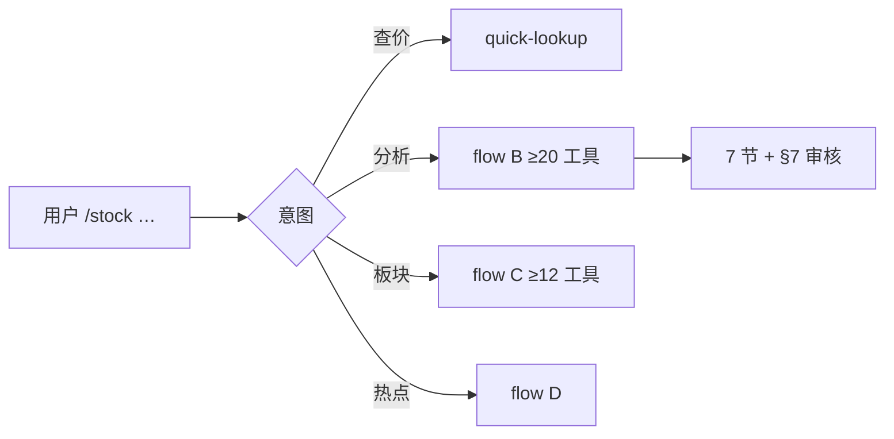
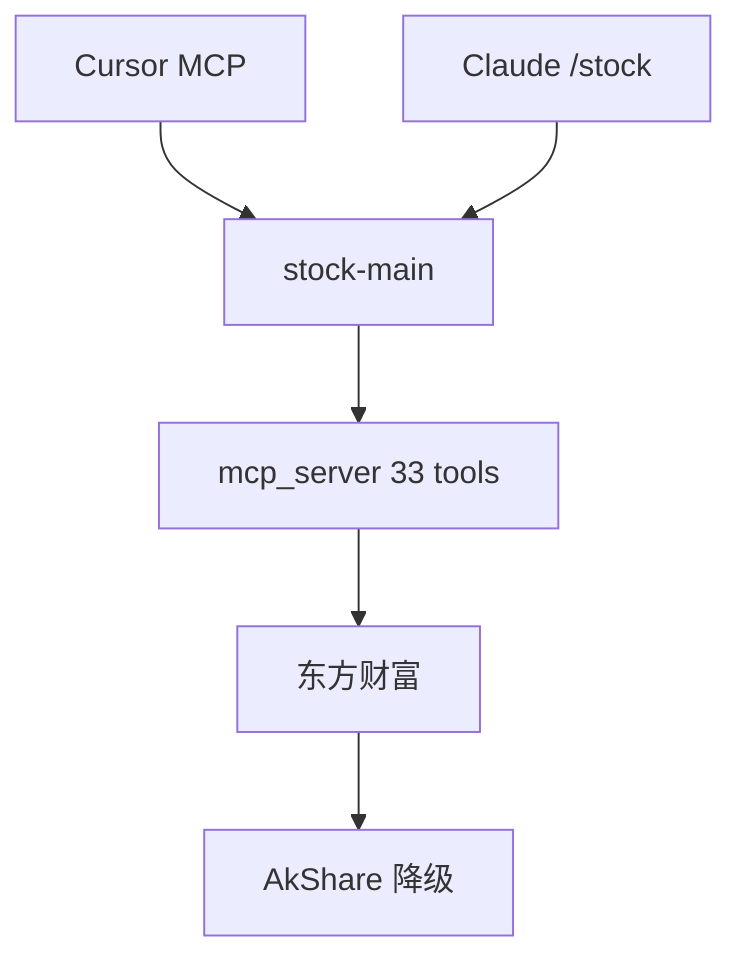

# 用法

## `/stock` 三种场景



| 场景 | 示例 | 输出 |
|------|------|------|
| 查价 | `/stock 600519` | 现价、涨跌幅 |
| 个股分析 | `/stock 分析 黔源电力` | 7 节报告 + 介入区间 |
| 板块选股 | `/stock 半导体板块，挑几只` | 板块评级 + 候选股 |
| 市场热点 | `/stock-market` | 主线 + 快讯 + 资金 |

## 报告结构（节选）

```markdown
# 贵州茅台 · 综合分析
> 评级：**右侧等待** · 置信度：**6/10**

## 1. 结论与近期操作
看线、介入区间、失效位 …

## 2~6. 基本面 / 技术 / 资金 / 事件 / 风险

## 7. 审核纪要
R2 数据审计 · R6 置信度门禁
```

## 专项命令

仅单维度时使用；买卖建议请 **`/stock 分析`**。

| 命令 | 示例 |
|------|------|
| `/stock-fund` | `/stock-fund 600519` |
| `/stock-chip` | `/stock-chip 比亚迪` |
| `/stock-kline` | `/stock-kline 招商银行` |
| `/stock-basic` | `/stock-basic 五粮液` |
| `/stock-sector` | `/stock-sector 电池` |
| `/stock-news` | `/stock-news 隆基绿能` |
| `/stock-market` | `/stock-market 今天热点` |

## 架构



| 维度 | 工具 |
|------|------|
| 基本面 | 三表、估值、股东 |
| 技术 | K 线、MA、相对沪深300 |
| 资金筹码 | 主力、筹码 |
| 舆情 | 快讯、新闻、龙虎榜 |
| 量化 | Alpha158/360、OOS 状态 |
