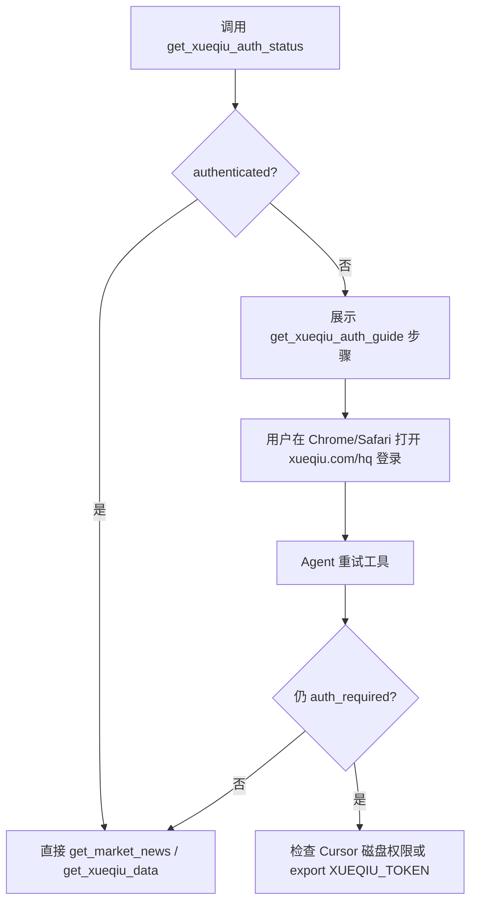

# 雪球授权流程（E2E）

本仓库通过 **浏览器 Cookie** 访问雪球帖子/热门资讯；**讨论热榜**（`xueqiu_hot`）通常无需登录。

---

## 能力矩阵

| 能力 | 工具 | 是否需要登录 |
|------|------|--------------|
| 讨论热榜 | `get_market_news --news-type xueqiu_hot` | 否 |
| 热门资讯 | `get_market_news --news-type xueqiu_livenews --source xueqiu` | 是 |
| 个股帖子/研报 | `get_news_and_reports --source xueqiu` | 是 |
| 扩展数据 | `get_xueqiu_data` | 是 |

---

## 推荐流程（Cursor / 本机 Agent）



### 1. 诊断

```bash
python scripts/em.py get_xueqiu_auth_status
python scripts/em.py get_xueqiu_auth_guide --reason missing_token
```

返回 `authenticated: true` 即可继续；若为 `false`，进入步骤 2。

### 2. 浏览器登录

1. 在 **Chrome 或 Safari** 打开 [https://xueqiu.com/hq](https://xueqiu.com/hq)
2. 完成登录（保持会话）
3. **不要**把 `xq_a_token` 粘贴到 Issue / PR / 聊天记录

组件会从浏览器 Cookie 读取 `xq_a_token`，一般 **无需** `export XUEQIU_TOKEN`。

### 3. Agent 暂停与继续

当工具返回 `status: auth_required` / `interrupt: true` 时：

1. Agent 应展示 `get_xueqiu_auth_guide` 中的 `user_message`
2. 等待用户登录后 **在同一对话重试**
3. 禁止在未授权时编造雪球帖子内容

### 4. MCP 读不到 Cookie，或已登录仍无「深度帖」

| 现象 | 处理 |
|------|------|
| CLI 成功、MCP 失败 | macOS：系统设置 → 隐私 → **完全磁盘访问** → 勾选 Cursor → 重启 |
| `authenticated: true` 但无个股帖子 | 雪球 **个股页 WAF（滑动验证）**；在 Chrome 打开 `https://xueqiu.com/S/{SH\|SZ代码}` 手动滑块验证后重试 |
| 无图形环境 / CI | `export XUEQIU_TOKEN='你的xq_a_token值'`（仅值，非整串 Cookie） |

环境变量（兜底）：

```bash
export XUEQIU_TOKEN='...'   # 对应 Cookie 名 xq_a_token
# 或整串 Cookie（较少用）
export XUEQIUTOKEN='xq_a_token=...; ...'
```

---

## Live 冒烟

```bash
# 东财 + 板块 + 审核（默认）
LIVE=1 bash scripts/smoke_live.sh

# 含雪球热榜（无需 token）
LIVE=1 bash scripts/smoke_live.sh   # 已含 test_xueqiu_hot

# 含需登录接口（CI 可注入 secret XUEQIU_TOKEN）
LIVE=1 XUEQIU_TOKEN='...' bash scripts/smoke_live.sh
```

---

## 安全

- 勿提交 Cookie / Token：见 [SECURITY.md](../SECURITY.md)
- Token 失效时重新登录 hq 页，或更新 `XUEQIU_TOKEN`

---

## 相关 Skill

- `agent-skills/stock-event-research/SKILL.md`
- `agent-skills/stock-main/SKILL.md`（D 流程）
